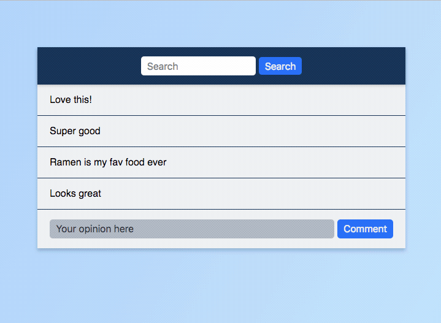

# Board Out of My Mind

Single-page message board app built entirely with 🍨 Vanilla JS 🍨

## Steps

# Message Board

Message board built with custom components that look a lot like React.

1. Message Board (this is our app container)
   1. init API dependency
   2. state
   3. event listener for `handleSearchSubmit`
      1. Interacts with API's `filterCommentsByText`
   4. event listener for `handleAddComment`
      1. Interacts with API's `addComment`
      2. Make sure to reset form!
   5. Pass data down to Comments via `setAttribute`
2. Comments
   1. rerender on `comments` attribute change
3. Message Board
   1. `setState` function
4. Comment
   1. CustomEvent for `removeComment`

## Resources

- [The ES6 way to loop through objects with vanilla JavaScript](https://gomakethings.com/the-es6-way-to-loop-through-o)
- [Javascript Set Attribute With Single Quotation](https://stackoverflow.com/questions/29738257/javascript-set-attribute-with-single-quotation)
- [Creating and triggering events](https://developer.mozilla.org/en-US/docs/Web/Guide/Events/Creating_and_triggering_events)
- [Bubbling and capturing](https://javascript.info/bubbling-and-capturing)
  - 
